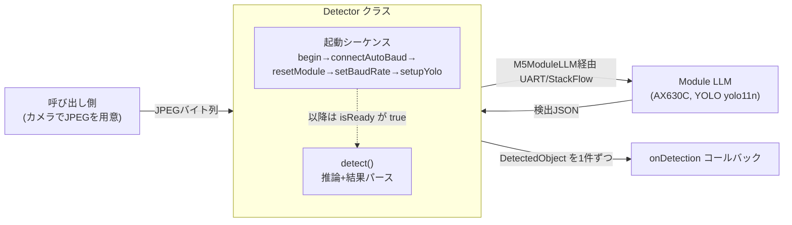
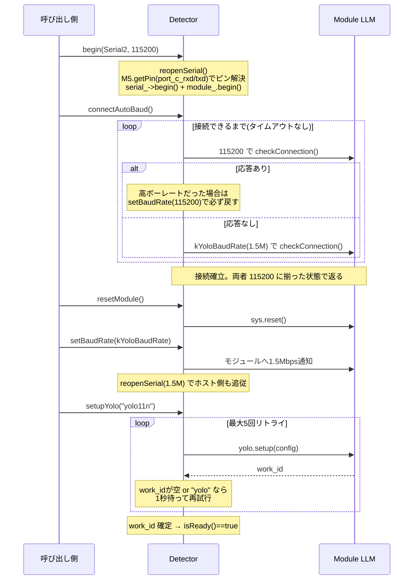
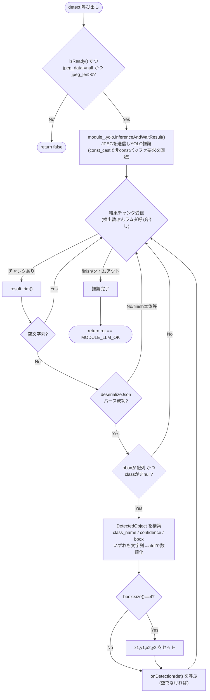

# yolo_object_detector の処理内容

`lib/yolo_object_detector/`(M5Stack Module LLM 上の YOLO で物体検出を行う移植可能パッケージ)の
内部処理を図式化する。ソースは `src/yolo_object_detector.{h,cpp}`、公開契約は [../README.md](../README.md) を参照。

このパッケージはカメラ/LCD に依存せず、**JPEG バイト列を入力 → 検出物体のリストを出力**する。
UART(StackFlow)通信・ボーレート切替・`yolo.setup` / `yolo.inferenceAndWaitResult` 呼び出し・
検出結果 JSON のパースまでを内部で面倒見る。

## 全体像



## 起動シーケンス(setup 時に1回)

呼び出し順序は [../README.md](../README.md) の「使い方」と同じ。ホスト側だけ再起動しても復帰できるよう、
`connectAutoBaud()` が必ず 115200 に揃えてから、リセット → 1.5Mbps 昇圧 → YOLO セットアップと進む。



### connectAutoBaud が必要な理由

`setBaudRate()` で上げたボーレートは**モジュール側の電源を切るまで保持される**。ホスト側だけ再起動すると
「モジュール=1.5Mbps / ホスト=115200」でずれ、永久に接続できなくなる(`checkConnection()` が1回2秒
待つため止まって見える)。そこで両候補で ping し、接続できたら**必ず 115200 へ戻して**から返る。

## detect() の処理(ループ内、フレームごと)

`inferenceAndWaitResult()` はストリーミング型で、**検出結果 JSON チャンクが届くたびに内部ラムダを呼ぶ**。
ラムダは各チャンクを検証・パースし、有効な検出だけを `DetectedObject` にして `onDetection` へ渡す。



### ポイント

- **戻り値 `bool` は「通信が正常完了したか」**であって、検出件数や検出成否ではない。検出0件でも通信が
  正常なら `true` になり得る。実際の検出内容はすべて `onDetection` コールバック経由で受け取る。
- **class / confidence / bbox はいずれも文字列で返る**(`YOLO_CoreS3.ino` 準拠)ため、`atof` で数値化する。
- 空チャンク(finish 時)やパース不能な JSON(finish メッセージ本体など)は、`onDetection` を呼ばずに
  黙ってスキップする。有効な検出 JSON のみをコールバックに流す設計。
- `const_cast` は下層 API(`inferenceAndWaitResult`)が非 const バッファを要求するための回避で、
  入力 JPEG は detect() 内で書き換えない借用契約。
- 座標は **入力 JPEG のピクセル空間** の `[x1,y1,x2,y2]`(左上・右下の対角コーナー)。LCD へ重畳する場合は
  呼び出し側で表示解像度へスケーリングする。

## onDetection コールバックの仕様

`detect()` の第3引数に渡す、検出結果を受け取るコールバックの契約。

```cpp
void onDetection(const DetectedObject& det);
// 型: const std::function<void(const DetectedObject&)>&
```

- **呼ばれるタイミング**: 推論中、**有効な検出1件につき1回**同期的に呼ばれる(`detect()` の内部、
  `inferenceAndWaitResult()` から呼び戻される形)。`detect()` が return した後には呼ばれない。
- **呼ばれる回数**: 0回以上。検出0件のフレームでは一度も呼ばれない。呼ばれた回数=そのフレームの検出数。
- **引数 `det`**: 検出1件。`const` 参照なので**読み取り専用**。有効値が入るフィールドは以下:
  | フィールド | 型 | 内容 |
  |---|---|---|
  | `class_name` | `String` | クラス名(例 `"person"`) |
  | `confidence` | `float` | 信頼度 |
  | `x1, y1` | `int` | bbox 左上コーナー(入力JPEGのピクセル空間) |
  | `x2, y2` | `int` | bbox 右下コーナー(入力JPEGのピクセル空間) |
- **引数の寿命**: `det` はコールバック呼び出し中のみ有効。後で使う値は**コールバック内でコピーして保持**すること
  (参照やポインタを外に持ち出さない)。
- **呼び出し側で行う典型処理**: 信頼度フィルタ(`if (det.confidence >= 閾値)`)、`std::vector` への収集、
  そのままログ出力や描画など。フィルタリングは detect 側では行わないため、必要なら呼び出し側で実装する。
- **保証されないこと**: 検出の**順序・件数・重複有無**は YOLO/モジュール依存で、パッケージは保証しない。
  空チャンクや不正 JSON はコールバックに渡らない(パッケージ内でスキップ済み)。
- **コールバック内での注意**: 同期的に呼ばれるため、**重い処理・長いブロッキングは推論全体を遅らせる**
  (ライブフレームレートに影響)。`detect()` を再入呼び出ししないこと。
- **空のコールバック**: `onDetection` が空(未設定)でも安全。パッケージ側で `if (onDetection)` を確認してから
  呼ぶため、渡さなくても推論自体は実行される(結果を受け取れないだけ)。

## コールバック方式について

`detect()` が結果を戻り値(`std::vector`)ではなくコールバックで返すのは、下層の
`inferenceAndWaitResult()` 自体がストリーミング/コールバック型であり、それを**薄くラップする**方針だから。
検出を受け取った瞬間に処理して捨てられるため、`String` を含む `DetectedObject` の vector を毎フレーム
確保する必要がなく、ヒープ断片化を避けられる利点がある(メモリ制約のある CoreS3 向け)。

## 関連ドキュメント

- 公開API・移植手順・使い方: [../README.md](../README.md)
